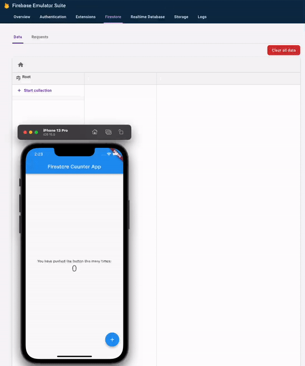

# Firestore Counter App

A Firestore Hello World using the Flutter Counter Starter App, with setup for the Local Firebase Firestore Emulator. 

## Getting Started

See the Medium article [here](https://medium.com/@gangyistudios/firestore-counter-app-firestore-and-flutter-in-2022-with-firebase-local-emulator-suite-recipe-9d6e510a53f3)!

Before running this Flutter project, you will need to:

1. Create a new Firebase project if you don't have one already, and enable Firestore.

2. Configure Firebase project to Flutter app using FlutterFire CLI

```
flutterfire configure
```

3. Initialize emulators - select Firebase Feature: Emulators only -> Firestore emulator only, then defaults for the rest. Note, we are not selecting Firestore here as `flutterfire` has already handled that for us.

```
firebase init
```

4. Run the emulator suite, check all is working well by checking the [Emulator UI Dashboard](http://localhost:4000)

```
firebase emulators:start
```

5. Bring up the [Firestore Emulator UI](http://localhost:4000/firestore) to view live changes

6. Run app in debug mode

```
flutter run
```

7. Incrementing the counter should now update the local Firestore emulator instance in real time, as in the "Local Firestore Emulator" demo below. 

8. Visit the [full article](https://medium.com/@gangyistudios/firestore-counter-app-firestore-and-flutter-in-2022-with-firebase-local-emulator-suite-recipe-9d6e510a53f3) on Medium for an in-depth recipe!

## Demo 

### Local Firestore Emulator 



### Production Firestore 


